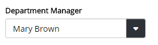

Single Picker
============================

.. note:: This component is an Angular 1 directive registered in module **Omnia.Foundation.Core.Module**

The single picker is a dropdown component that supports type-ahead search and customizable UI.

Sample
----------------------------

.. code-block:: javascript

  $scope.employees = [
    { id: 1, firstName: 'Mary', lastName: 'Brown', age: 27 },
    { id: 2, firstName: 'John', lastName: 'Smith', age: 36 }
  ];

  $scope.department = {
    id: 1, 
    name: "Marketing", 
    managerId: 1
  }

.. code-block:: html

  <omf-single-picker 
    items="employees" 
    title-expression="[firstName] [lastName]" 
    id-prop="id" 
    bind-selected-item-id="department.managerId" 
    pre-selected-item-id="department.managerId">
  </omf-single-picker>  

Properties
----------------------------
 
=================================  ============ =====================================================================================
Name                               Binding      Description
=================================  ============ =====================================================================================
items                              =            The list of options in the dropdown
titleProp                          @            The property on model to be used as the display text
titleExpression                    @            The format string for display text. Example: **[firstName] [lastName] ([email])**
idProp                             @            The property on model to be used as the value
onSelect                           &            Callback when an option is selected. Parameters: (selectedItem, parentItem)
onDeselect                         &            Callback when the dropdown is cleared.
onOpen                             &            Callback when the dropdown is opened. 
bindSelectedItemId                 =            The selected value. This property is only one-way binding from the dropdown to the consumer scope.
preSelectedItemId                  =            The initial selected value.
updateSelectedItemEvent            @            The event name used to update selected value of the dropdown from outsite scope.
preSelectFirstItem                 @            **true** or **false** - whether to preselect the first option if no initial selected value is provided.
parentItem                         =            An object to be pass along the selected item on the **onSelect** callback.
=================================  ============ =====================================================================================
