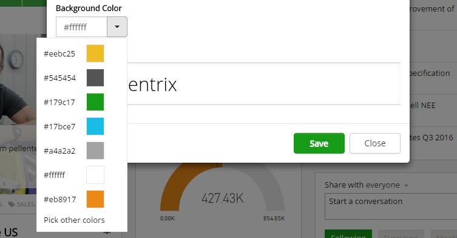

ColorPicker
=============================

.. note:: This documentation is a work in progress and contributions can be made on our Github repo

ColorPicker is a component for selecting color from Omnia corporate colors feature or from custom colors.

How it looks like
--------------------------------------------------

Selector
--------------------------------------------------

.. code-block:: html

    <omf-color-picker></omf-color-picker>

Parameters
--------------------------------------------------

| - **color: string**
| Two-way bind selected color.
|
|

| **onColorChange: (color: string) => void**
| Even handler for the color selected event.
|
|

| **position: string**
| The position of the color picker popover. Must be one of these: 'top', 'bottom', 'left', 'right'
|
|

Examples
--------------------------------------------------

.. code-block:: javascript
   
   import { Component, Inject, ViewContainerRef } from '@angular/core';

   @Component({
        selector: 'my-component'        
   })
   export class MyComponent {
        selectedColor = '#ffffff';

        constructor(@Inject(ViewContainerRef) private viewContainer: ViewContainerRef) {
        }
   }

.. code-block:: html

    <omf-color-picker [color]="selectedColor" [position]="'bottom'"></omf-color-picker> 
                      