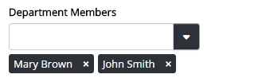

Multi Picker
============================

.. note:: This component is an Angular 1 directive registered in module **Omnia.Foundation.Core.Module**

The multi picker is a dropdown component that supports multiple selected values, type-ahead search and customizable UI.

Sample
----------------------------

.. code-block:: javascript

  $scope.employees = [
    { id: 1, firstName: 'Mary', lastName: 'Brown', age: 27 },
    { id: 2, firstName: 'John', lastName: 'Smith', age: 36 }
  ];

  $scope.department = {
    id: 1, 
    name: "Marketing", 
    managerId: 1,
    members: [
     { id: 1, firstName: 'Mary', lastName: 'Brown', age: 27 },
     { id: 2, firstName: 'John', lastName: 'Smith', age: 36 }
    ]
  }

.. code-block:: html

  <omf-multi-picker items="employees"
                    title-expression="[firstName] [lastName]"
                    selected-items="department.members">
  </omf-multi-picker> 

Properties
----------------------------
 
=================================  ============ =====================================================================================
Name                               Binding      Description
=================================  ============ =====================================================================================
items                              =            The list of options in the dropdown
titleProp                          @            The property on model to be used as the display text
titleExpression                    @            The format string for display text. Example: **[firstName] [lastName] ([email])**
idProp                             @            The property on model to be used as the value
onSelect                           &            Callback when an option is selected. Parameters: (selectedItem)
onDeselect                         &            Callback when the dropdown is cleared.
onOpen                             &            Callback when the dropdown is opened. 
selectedItems                      =            The selected value. This property is only two-way binding between the dropdown and the consumer scope.
=================================  ============ =====================================================================================
