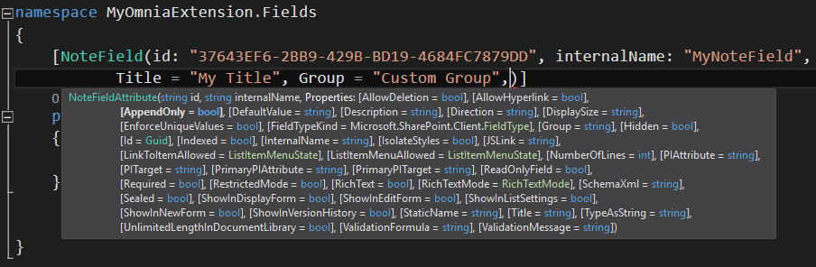

Field
============================

Fields are used in Lists and Content Types in SharePoint and Omnia Foundation makes it easy to create field definitions by using attributes that can be provisioned using a, :doc:`Omnia feature </fundamentals/omnia-feature>` or referenced in a :doc:`List definition </sharepoint-provisioning/lists>`.

All field attributes are located in the **Omnia.Foundation.Extensibility.Fields** namespace
and the following list contains the different attributes that can be used to create field definitions. 

=================================  =====================================================================================
Attribute                          Description
=================================  =====================================================================================
FieldAttribute                     The base attribute that all field attributes inherits from containing generic properties like title, description etc
BooleanFieldAttribute              Boolean field definition
CalculatedFieldAttribute           Calculated field definition
DateTimeFieldAttribute             DateTime field definition
HTMLFieldAttribute                 HTML field definition
LookupFieldAttribute               Lookup field definition
ManagedMetadataFieldAttribute      Managed metadata field definition
NoteFieldAttribute                 Note field definition
NumberFieldAttribute               Number field definition
TextFieldAttribute                 Text field definition
UrlFieldAttribute                  Url field definition
UserFieldAttribute                 User field definition
=================================  =====================================================================================

Field definitions can be referenced both in list definitions and content type definitions, so they are defined using class level attribute decoration. Below is an example of how to define a basic NoteField using the NoteFieldAttribute

.. code-block:: c#

    [NoteField(id: "37643EF6-2BB9-429B-BD19-4684FC7879DD", internalName: "MyNoteField",
           Title = "My Title", Group = "Custom Group")]
    public class MyNoteField : FieldBase
    {

    }

.. note:: Even if the attribute is called **NoteFieldAttribute** its not necessary to include Attribute in the name, **NoteField** is enough and that will make the code look more clean.
  
All field definitions requires the minimal **id** and **internalName** parameters since this is required to be able to create the field. For the different field attributes there are always minimal required parameters that need to be provided but there is also optional properties that can be specified. Below is an example of all the optional properties that can be specified on the NoteFieldAttribute

Now that we have a field definition we can either use a site-scoped or sitecollection-scoped :doc:`Omnia feature </fundamentals/omnia-feature>` to deploy it to a site or use it in a :doc:`List definition </sharepoint-provisioning/lists>`.

