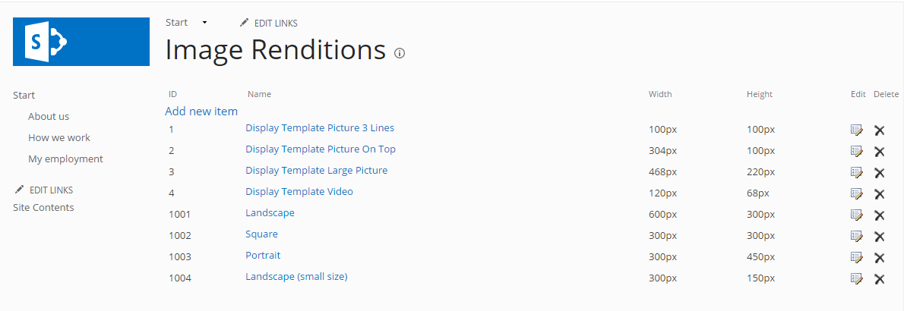

Image Rendition
============================

By using attributes it is easy to specify and provision Image Renditions to SharePoint

To create Image Renditions start by creating a new class that inherits from **ImageRenditionBase** then apply the **ImageRendition** attribute on your class. The **id** of your Image Rendition should start on a higher number so that it wont conflict with the built in SharePoint and Omnia Image Renditions. SharePoint starts with Id 1 and ends on 4 and Omnia on 1001 and ends on 1004 but your customization could start on 2000 to be sure not to write over existing renditions. If you want the height to be dynamic then you can set it to **0**

.. code-block:: c#

    [ImageRendition(id: 1001, name: "$Localize:OMF.Core.ImageRenditions.Landscape;", width: 600, height: 300)]
    [ImageRendition(id: 1002, name: "$Localize:OMF.Core.ImageRenditions.Square;", width: 300, height: 300)]
    [ImageRendition(id: 1003, name: "$Localize:OMF.Core.ImageRenditions.Portrait;", width: 300, height: 450)]
    [ImageRendition(id: 1004, name: "$Localize:OMF.Core.ImageRenditions.LandscapeSmallSize;", width: 300, height: 150)]
    public class PortalCoreImageRendition : ImageRenditionBase
    {
    }

Now that we have the specification of the Image Renditions all we need to do is to add the mapping code in the **OnSharePointArtifacts** method of an :doc:`Omnia feature </fundamentals/omnia-feature>` that will perform the deployment. 

.. note:: The provisioning must be done from a Site Collection scoped feature

.. code-block:: c#

  public override void OnSharePointArtifactMappings(SharePointArtifactMapper artifactMapper)
        {
            artifactMapper.MapToImageRendition<PortalCoreImageRendition>();
        }

